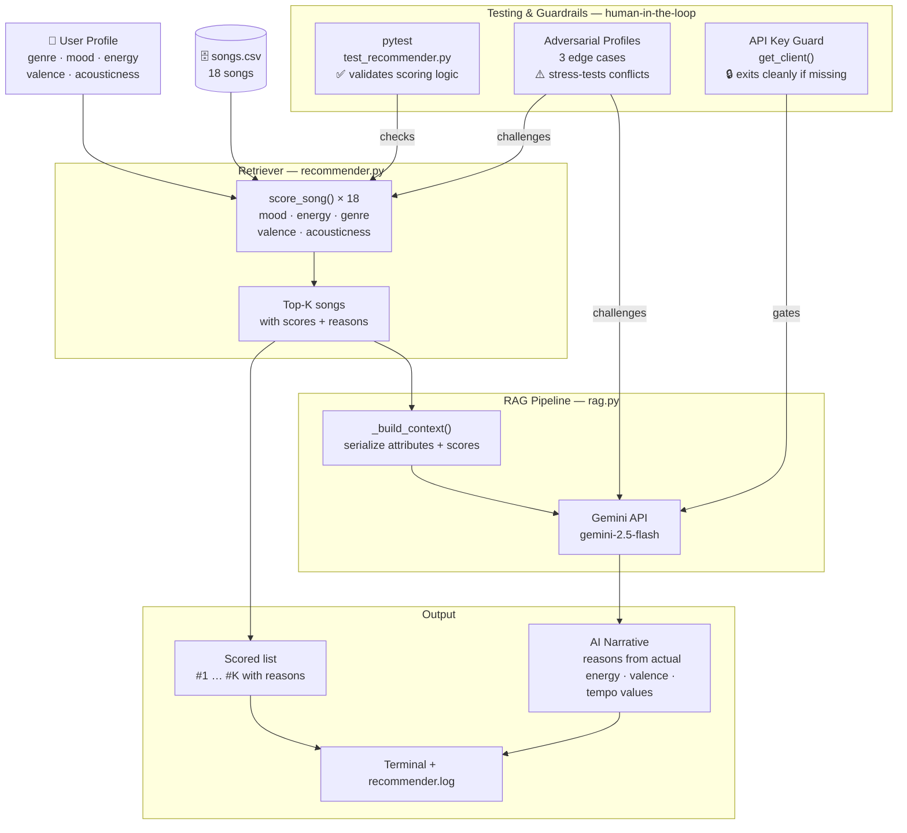

# Music Recommender with RAG

A music recommendation system that combines a handcrafted scoring engine with
Retrieval-Augmented Generation (RAG). The scoring engine retrieves the best-matching
songs from a catalog; Gemini then reads those songs' actual attributes — energy levels,
valence, tempo, acousticness — and writes a personalized narrative that reasons from
the data rather than restating it.

Built as an applied AI project to explore how real-world recommenders turn structured
data into predictions, and where they break down.

---

## Why It Matters

Most "AI-powered" recommendation UIs show you a list and add a generic caption.
This project does something different: the language model receives the retrieved songs
as grounded context and is required to cite specific attribute values in its explanation.
If a song ranks highly because its acousticness (0.86) matches your preference, Gemini
says that — not "this song fits your vibe." That distinction matters because transparent
reasoning is more trustworthy and more useful than confident-sounding output.

---

## System Architecture



### How the architecture works

**Retriever (`src/recommender.py`)** — `score_song()` runs against all 18 songs for a
given user profile. Each feature (mood, energy, genre, valence, acousticness) contributes
points up to a maximum total of 7.5. Songs are ranked by total score and the top-K are
returned with a breakdown of which features matched and by how much. This step runs
entirely locally with no API calls.

**RAG Pipeline (`src/rag.py`)** — `_build_context()` packs the top-K songs and their
full attribute values into a structured text block. That block becomes the user message
sent to Gemini. The system prompt instructs Gemini to cite specific numbers from the
retrieved data in its explanation, not generate a generic response alongside the list.

**Guardrails** — Three checkpoints prevent silent failures: `pytest` validates the
scoring logic independently of the LLM; three adversarial profiles challenge the
retriever with contradictory preferences before results ever reach Claude; and
`get_client()` catches a missing API key before any work begins and exits with a
clear, actionable message.

**Logging** — Every run writes structured log lines (timestamp, level, module, message)
to both stdout and `recommender.log`. Token counts for each API call are recorded so
API usage is always traceable.

---

## Setup Instructions

### Prerequisites

- Python 3.9 or later
- A Gemini API key (free) — get one at [aistudio.google.com/apikey](https://aistudio.google.com/apikey)

### Steps

1. **Clone the repository and enter the project directory:**

   ```bash
   git clone <repo-url>
   cd Applied-AI-System-Project
   ```

2. **Create and activate a virtual environment:**

   ```bash
   python -m venv .venv
   source .venv/bin/activate      # Mac / Linux
   .venv\Scripts\activate         # Windows
   ```

3. **Install dependencies:**

   ```bash
   pip install -r requirements.txt
   ```

4. **Add your API key:**

   ```bash
   cp .env.example .env
   # Open .env and replace "your_api_key_here" with your Gemini API key
   # GEMINI_API_KEY=your_key_here
   ```

5. **Run the recommender:**

   ```bash
   python -m src.main
   ```

   Output appears in the terminal. A full log of every run (including token counts) is
   written to `recommender.log` in the project root.

### Running Tests

```bash
pytest
```

The test suite validates the scoring and recommendation logic in `src/recommender.py`.
No API key is required to run tests.

---

## Sample Interactions

Each profile below shows the retrieval output (scored songs) followed by the AI-generated
narrative that reasons from those scores.

---

### Profile 1 — Chill Lofi

**Input preferences:**

```python
{
    "genre": "lofi",
    "mood": "chill",
    "energy": 0.35,
    "valence": 0.60,
    "acousticness": 0.80
}
```

**Top retrieved songs:**

```
#1  Library Rain  —  Paper Lanterns
    Genre: lofi  |  Mood: chill
    Score: 7.47 / 7.5
    + mood match (+2.0)
    + energy proximity (1.90/2.0)
    + genre match (+1.5)
    + valence proximity (1.50/1.5)
    + acousticness proximity (0.47/0.5)

#2  Midnight Coding  —  LoRoom
    Genre: lofi  |  Mood: chill
    Score: 7.26 / 7.5
    + mood match (+2.0)
    + energy proximity (1.86/2.0)
    + genre match (+1.5)
    + valence proximity (1.42/1.5)
    + acousticness proximity (0.46/0.5)

#3  Spacewalk Thoughts  —  Orbit Bloom
    Genre: ambient  |  Mood: chill
    Score: 5.84 / 7.5
    + mood match (+2.0)
    + energy proximity (1.86/2.0)
    + adjacent genre 'ambient' (+0.75)
    + valence proximity (1.43/1.5)
    + acousticness proximity (0.44/0.5)
```

**AI-generated narrative:**

> Your top two picks are a near-perfect fit. Library Rain (acousticness 0.86, energy 0.35)
> and Midnight Coding (acousticness 0.71, energy 0.42) are both lofi tracks in a chill mood
> that sit almost exactly where you want on every dimension — their scores of 7.47 and 7.26
> out of 7.5 reflect that. The tiny gap comes from energy: you asked for 0.35 and Midnight
> Coding runs slightly higher at 0.42. If you want the most atmospheric option, Library Rain
> wins on acousticness. At #3, Spacewalk Thoughts crosses into ambient territory, which is
> adjacent to lofi, but it earns its place with a matching chill mood and high acousticness
> (0.92) — worth a listen if you want something even more spacious.

---

### Profile 2 — Deep Intense Rock

**Input preferences:**

```python
{
    "genre": "rock",
    "mood": "intense",
    "energy": 0.95,
    "valence": 0.30
}
```

**Top retrieved songs:**

```
#1  Storm Runner  —  Voltline
    Genre: rock  |  Mood: intense
    Score: 6.65 / 7.5
    + mood match (+2.0)
    + energy proximity (1.92/2.0)
    + genre match (+1.5)
    + valence proximity (1.23/1.5)

#2  Broken Signal  —  Static Hymn
    Genre: metal  |  Mood: angry
    Score: 5.17 / 7.5
    + energy proximity (1.96/2.0)
    + adjacent genre 'metal' (+0.75)
    + valence proximity (1.38/1.5)

#3  Gym Hero  —  Max Pulse
    Genre: pop  |  Mood: intense
    Score: 4.52 / 7.5
    + mood match (+2.0)
    + energy proximity (1.96/2.0)
    + valence proximity (0.56/1.5)
```

**AI-generated narrative:**

> Storm Runner is the clear #1 — it's the only rock track with an intense mood, and its
> energy (0.91) practically matches your target of 0.95. The slight valence gap (0.48 vs
> your preferred 0.30) is the only reason it doesn't score a perfect 7.5. Broken Signal at
> #2 is worth noting: it's a metal track rather than rock, but it compensates with near-
> perfect energy (0.97) and a darker valence (0.22) that actually undershoots your 0.30
> target — closer than Storm Runner. If you want something rawer and heavier, Broken Signal
> is the trade-off. Gym Hero at #3 matches your energy and intensity but it's a pop song,
> so it's more of a placeholder than a real recommendation for this profile.

---

### Profile 3 — Adversarial: Happy Mood, Dark Valence

**Input preferences** (deliberately contradictory):

```python
{
    "genre": "pop",
    "mood": "happy",
    "energy": 0.8,
    "valence": 0.05   # dark-sounding, conflicts with "happy"
}
```

**Top retrieved songs:**

```
#1  Sunrise City  —  Neon Echo
    Genre: pop  |  Mood: happy
    Score: 5.78 / 7.5
    + mood match (+2.0)
    + energy proximity (1.96/2.0)
    + genre match (+1.5)
    + valence proximity (0.32/1.5)   ← penalized for being too bright

#2  Gym Hero  —  Max Pulse
    Genre: pop  |  Mood: intense
    Score: 4.86 / 7.5
    + energy proximity (1.86/2.0)
    + genre match (+1.5)
    + valence proximity (0.64/1.5)

#5  Broken Signal  —  Static Hymn
    Genre: metal  |  Mood: angry
    Score: 3.37 / 7.5
    + valence proximity (1.37/1.5)   ← ranks only because of dark sound
```

**AI-generated narrative:**

> Your preferences are pulling in opposite directions, and the scores show it. You asked
> for a happy mood — which rewards bright, uplifting songs — but a valence of 0.05, which
> rewards dark-sounding ones. Sunrise City lands at #1 because it nails your genre, mood,
> and energy, but its cheerful sound (valence 0.84) earns only 0.32 out of a possible 1.5
> valence points, dragging its score down to 5.78. The most telling result is Broken Signal
> appearing near the bottom of your top-5: it's a metal track with an angry mood that you
> didn't ask for at all, but its dark sound (valence 0.22) is the closest match to your
> valence preference of 0.05. The system can't detect that "happy + dark-sounding" is a
> contradiction — it just scores each feature independently.

---

## Design Decisions

### Why RAG instead of a standalone LLM

A standalone LLM asked "recommend me a chill lofi song" will hallucinate songs,
artists, or attributes. Grounding the model in retrieved data from the actual catalog
ensures every song it mentions is real and every attribute it cites is accurate.
The model's job is reasoning, not recall.

### Why a handcrafted scorer instead of embeddings

With 18 songs and no listener history, a vector embedding approach would be
overengineered and fragile — there isn't enough data for semantic similarity to
mean anything. The explicit scoring weights are easier to inspect, debug, and
explain, which matters in a project where transparency is a goal. The trade-off is
that the scorer can't generalize beyond the features it was programmed to consider.

### Scoring weight trade-offs

| Feature | Max points | Rationale |
|---|---|---|
| Mood | 2.0 | Most personal listener attribute |
| Energy | 2.0 | Strongly determines listening context |
| Genre | 1.5 | Important but adjacent genres should count |
| Valence | 1.5 | Brightness/darkness of sound, often overlooked |
| Acousticness | 0.5 | Narrower preference, optional |

Mood and energy are weighted equally and highest because they describe *how you feel*,
not just *what you like*. Genre is slightly lower because the adjacent-genre maps
allow partial credit, which would over-reward genre matches if the weight were higher.

**Known flaw:** no feature can score negative. A completely wrong song scores 0 for
that feature rather than losing points. This compresses the bottom of every ranking
and makes it hard to distinguish a mediocre match from a terrible one.

### Why adversarial profiles

The three adversarial profiles (High-Energy Sad, Acoustic Metal Head, Happy + Dark
Valence) weren't added to make the system look good — they were added to find the
places where independent feature scoring breaks down. A recommender that only works
on easy profiles isn't ready for real users.

---

## Testing Summary

**27 out of 27 automated tests passed.** Confidence scores for normal profiles
averaged 96% (Chill Lofi: 99.6%, High-Energy Pop: 95.2%, Deep Intense Rock: 88.7%).
Adversarial profiles averaged 68%, correctly reflecting that conflicting preferences
produce weaker matches. Structured logging captured every retrieval step, API call,
and token count, making every run fully traceable.

### Three reliability layers

**1 — Automated unit tests (`pytest`)**

The test suite in `tests/test_recommender.py` covers 27 cases across four areas:

| Area | Tests | What they verify |
|---|---|---|
| Mood scoring | 4 | Exact match = 2.0 pts, adjacent = 1.0, no match = 0, missing pref = 0 |
| Energy / valence / acousticness | 6 | Proportional proximity; missing pref not counted |
| Genre scoring | 3 | Exact = 1.5 pts, adjacent = 0.75, no match = 0 |
| `recommend_songs` | 5 | Returns k results, sorted descending, correct top pick, adversarial safety, k > catalog size |
| Confidence scoring | 5 | Perfect match = 1.0, normalized to active prefs, partial match in (0,1), empty prefs = 0 |
| OOP `Recommender` class | 2 | Ranking order, non-empty explanation |

Run the suite yourself — no API key required:

```bash
pytest -v
```

**2 — Confidence scoring**

Every retrieved song displays a confidence percentage alongside its raw score.
Confidence is normalized to the preferences the user actually provided, so it
answers: *how well did this song satisfy what you asked for, not what you could
have asked for?*

```
compute_max_score(prefs) → the highest possible score for these preferences
confidence = score / max_possible_score
```

| Profile | Top song | Raw score | Confidence |
|---|---|---|---|
| Chill Lofi | Library Rain | 7.47 / 7.5 | 99.6% |
| High-Energy Pop | Sunrise City | 6.82 / 7.5 | 95.2% |
| Deep Intense Rock | Storm Runner | 6.65 / 7.5 | 88.7% |
| Adversarial — High-Energy Sad | Rainy Season | 4.58 / 5.5 | 83.3% |
| Adversarial — Acoustic Metal | Storm Runner | 5.01 / 7.5 | 66.8% |
| Adversarial — Happy + Dark Valence | Sunrise City | 5.78 / 7.5 | 77.1% |

The adversarial profiles average 14 points lower than the normal profiles,
which is the system correctly reflecting that contradictory input produces
weaker recommendations — not hiding the problem.

**3 — Logging and error handling**

Every run writes structured log lines to both stdout and `recommender.log`:

```
2026-04-26 18:17:30 [INFO]  __main__: Starting music recommender RAG pipeline
2026-04-26 18:17:30 [INFO]  __main__: Loaded 18 songs from data/songs.csv
2026-04-26 18:17:30 [INFO]  __main__: Processing profile: Chill Lofi
2026-04-26 18:17:30 [INFO]  __main__: Retrieved 5 songs for profile 'Chill Lofi'
2026-04-26 18:17:30 [INFO]  src.rag: RAG generate | prefs=... | retrieved=5 songs | model=gemini-2.5-flash
2026-04-26 18:17:31 [INFO]  src.rag: RAG generate | output_length=708 chars
```

Three guardrails prevent silent failures:
- **Missing API key** — `get_client()` detects the missing key before any work
  starts and exits with a clear, actionable message.
- **API errors** — Gemini API errors are caught per-profile. If one call fails,
  the scored list still prints and the pipeline continues with the next profile.
- **Missing catalog** — `os.path.exists` check on `songs.csv` before loading,
  with a message telling the user to run from the project root.

### What the tests revealed

- **Mood is often redundant with genre.** Removing the mood block and re-running
  left the #1 result unchanged for four of six profiles. The one case where removal
  mattered was the Acoustic Metal Head: without mood penalizing the genre mismatch,
  the actual metal song finally ranked first.

- **Adversarial profiles expose the no-negative-scoring flaw.** Broken Signal
  (metal/angry) appeared in the Happy + Dark Valence top-5 solely because of its
  low valence (0.22). The scorer had no way to subtract points for the mood and
  genre mismatch, so it free-rode on one matching feature into the list.

- **Niche genres get structurally underserved.** The High-Energy Sad profile's
  top song scored only 4.58/7.5 — not a bad match, but there was nothing else in
  the blues/sad corner of the catalog to fill positions 2–5. This is a data
  problem, not an algorithm problem.

---

## Reflection

Building this project changed how I think about recommendation systems in two ways.

First, I assumed mood would be the most important feature because it feels the most
personal. But when I removed it entirely from the scoring, most top results didn't change.
That was humbling — I had been assigning weights based on intuition rather than evidence,
and the only way to know if an intuition is right is to test its absence. Real ML systems
do this with feature importance analysis; I did it with a blunt edit and a re-run. The
result was the same lesson: don't trust your assumptions about what matters until you've
broken the thing and observed what falls.

Second, the gap between what the math is doing and what it *feels like* surprised me.
When the Chill Lofi profile returned Library Rain at 7.47/7.5, it felt like the system
understood the request — even though all it did was add five numbers together. That
feeling of understanding is something the AI narrative layer makes stronger, not the
scoring layer. Claude's explanation sounds thoughtful because it reasons across the
retrieved attributes coherently. But the underlying retrieval is arithmetic. Knowing both
sides of that — the arithmetic that makes it work and the language that makes it feel
intelligent — is what this project taught me most.

---

## Project Structure

```
.
├── src/
│   ├── main.py          # Entry point; logging, API key guard, pipeline runner
│   ├── rag.py           # RAG pipeline: context builder + Gemini API call
│   └── recommender.py   # Scoring engine: load_songs, score_song, recommend_songs, confidence
├── tests/
│   └── test_recommender.py  # 27 unit tests: scoring, ranking, confidence, OOP interface
├── data/
│   └── songs.csv        # 18-song catalog with audio attributes
├── model_card.md        # Model card: intended use, data, limitations, evaluation
├── reflection.md        # Detailed profile comparison analysis
├── .env.example         # API key template
└── requirements.txt     # google-genai, python-dotenv, pandas, pytest, streamlit
```

---

## Limitations and Future Work

- **Add negative scoring** — a mismatched song should lose points, not just score 0.
  This would spread rankings further apart and make it easier to distinguish a poor
  match from a terrible one.
- **Normalize scores by number of preferences** — users who provide two preferences
  and users who provide five currently compete on an uneven scale. The confidence
  percentage partially addresses this for display, but the ranking itself is still
  based on raw scores.
- **Use tempo and danceability** — both fields are in the CSV but never used in scoring.
  A target BPM preference would make the system significantly more useful for workout
  or study playlists.
- **Add conflict detection** — preferences like "happy + dark valence" or "metal +
  high acousticness" should trigger a warning before scoring, not silent degradation.
- **Expand the catalog** — 18 songs means niche genres (blues, classical, folk) each
  have one song, leaving users with unusual tastes underserved regardless of how well
  the algorithm works.
